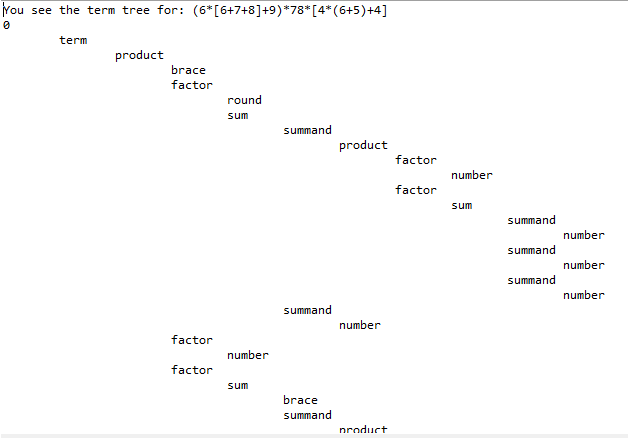
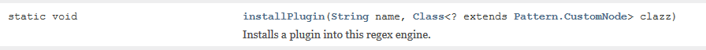

This is a Regular Expressions library for Java. Compared to java.util.regex, it supports Recursive and Conditional Regular Expressions, Capture Trees and Plugins.

## Table of Contents
- [Requirements for this tutorial](#requirements-for-this-tutorial)
- [API usage](#api-usage)
- [Regular Expression features](#regular-expression-features)
    - [Recursive Regular Expressions](#recursive-regular-expressions)
    - [Conditional Regular Expressions](#conditional-regular-expressions)
    - [Capture Trees](#capture-trees)
	- [Recursive replace](#recursive-replace)
	- [Plugins for the Regex engine](#plugins-for-the-regex-engine)
	- [Known Issues](#known-issues)
- [JavaDoc](#javadoc)	
- [Download](#download)	
- [Links](#links)

## Requirements for this tutorial
This tutorial assumes that you are already familiar with [Regular Expressions](http://www.regular-expressions.info/tutorial.html) and also with the [Regular Expression API of Java](https://docs.oracle.com/javase/tutorial/essential/regex/). 

## API usage
The API is exactly the same as in java.util.regex. The only difference is that the required import statement is `import com.florianingerl.util.regex.*;` instead of `import java.util.regex.*;`

Throughout this tutorial, we will make use of the following two utility functions:
```java
import com.florianingerl.util.regex.*;

private static void check(String p, String s, boolean expected) 
{
	Matcher matcher = Pattern.compile(p).matcher(s);
	if (matcher.find() != expected)
		System.exit(1);
}

static void check(String regex, String input, String[] expected) 
{
	List<String> result = new ArrayList<String>();
	Pattern p = Pattern.compile(regex);
	Matcher m = p.matcher(input);
	while (m.find()) {
		result.add(m.group());
	}
	if (!Arrays.asList(expected).equals(result))
		System.exit(1);
}
```

## Regular Expression features
In the following screenshot, all the new features are summarized.


## Recursive Regular Expressions
This section assumes that you are already familiar with [Recursive Regular Expressions](http://www.regular-expressions.info/recurse.html).
Be aware that the syntax `(?R)` or `(?0)` as in Perl is not supported by this library, only `(?n)` where `n` is greater than `0` or `(?'groupName')` is supported. Examples:
```java
//Matching Java types
String pattern = "^(?<javaType>[a-zA-Z]\\w*(?:\\<(?'javaType')(,(?'javaType'))*\\>)?)$";
check(pattern, "List<Integer>", true);
check(pattern, "HashMap<Integer,String>", true);
check(pattern, "Map<Integer,List<String>>", true);

//Matching constructs with an equal number of open and closing braces
check("(?<brace>\\((?:[^()]+|(?'brace'))*+\\))", "(go away (here (everything) is fine) afterwards",
				new String[] { "(here (everything) is fine)" });
				
//Matching anagrams
pattern = "\\b(([a-zA-Z])(?1)?\\2|[a-zA-Z])\\b";
check(pattern, "anna is an anagram, so is lagerregal and otto and radar and every single letter like z",
new String[] { "anna", "lagerregal", "otto", "radar", "z" });				
```

Different Regular Expression libraries handle Recursion, Group Capturing and Backreferences differently, so this topic deserves some comment here.

com.florianingerl.util.regex isolates capturing groups between each level of recursion. When the regex engine enters recursion, all capturing groups appear as they have not participated in the match yet. Initially, all backreferences will fail. During the recursion, capturing groups capture as normal. Backreferences match text captured during the same recursion as normal. When the regex engine exits from the recursion, all capturing groups revert to the state they were in prior to the recursion, except for the capturing group that was recursed to and has just been freshly captured.
These tests will illustrate:

```java
String pattern = "(?(DEFINE)(?<letter>[a-zA-Z]))\\b(?<anagram>(?'letter')(?'anagram')?\\k<letter>|(?'letter'))\\b";
check(pattern, "anna is an anagram, so is lagerregal and otto and radar and every single letter like z",
new String[] { "anna", "lagerregal", "otto", "radar", "z" });
pattern = "(?(DEFINE)(?<wrapper>(?<letter>[a-zA-Z])))\\b(?<anagram>(?'wrapper')(?'anagram')?\\k<letter>|(?'letter'))\\b";
check(pattern, "otto", false);

pattern = "(?(DEFINE)(?<second>\\k<first>))(?<first>[a-z])(?'second')";
check(pattern, "bb", false);
```

## Conditional Regular Expressions
This section assumes that you are already familiar with [Conditional Regular Expressions](http://www.regular-expressions.info/conditional.html) .
The syntax supported by this library is `(?(groupNumber)yes|no)` or `(?(groupName)yes|no)`. An example:

```java
String pattern = "(?:(\\()|\\[)[a-z]+(?(1)\\)|\\])";
check(pattern, "(first) [second] [not third) (not fourth match]", new String[] {"(first)", "[second]" });
```

## Capture Trees
This concept is best illustrated by an example. The following Regex (which is stored in the file term.regex) should parse mathematical terms such as `(6*[6+7+8]+9)*78*[4*(6+5)+4]` .

```
(?x) # comment mode
(?(DEFINE)
(?<term>(?'number')|(?'sum')|(?'product'))
(?<sum> 
(?'summand')(?:\+(?'summand'))+
) # end of sum
(?<summand> (?'number') | (?'product') | \( (?: (?'sum') | (?'product') ) \) | \[ (?: (?'sum') | (?'product') ) \]) # end of summand
(?<product> 
(?'factor')(?:\*(?'factor'))+
) # end of product
(?<factor>(?'number')| \( (?: (?'sum') | (?'product') ) \) | \[ (?: (?'sum') | (?'product') ) \] ) # end of factor
(?<number>\d+)
)# end of DEFINE
(?'term')
```

After having parsed a term, you can inspect the so-called Capture Tree of the match, which reflects the hierarchical nature of the groups. E.g. in this case, the term `(6*[6+7+8]+9)*78*[4*(6+5)+4]` is a product which consists of three factors. The first one of these factors is a sum and so on...

The following code

```java
String regex = IOUtils.toString( new FileInputStream("term.regex"), "UTF-8");
Pattern p = Pattern.compile(regex);

String term = "(6*[6+7+8]+9)*78*[4*(6+5)+4]";

System.out.println("Capture Tree for: " + term);
Matcher m = p.matcher(term);
m.matches();
System.out.println(m.captureTree());
```

produces the output seen in the following screenshot:


## Recursive replace
Continuing with the example from above, we now want to replace each sum like `6+7` with `sum(6,7)` and to replace each product like `5*3` with `product(5,3)`. The short code snippet

```java
String replacement = m.replaceAll( new DefaultCaptureReplacer() {
			@Override
			public String replace(CaptureTreeNode node) {
				if ("sum".equals(node.getGroupName())) {
					return "sum(" + node.getChildren().stream().filter(n -> "summand".equals(n.getGroupName()))
							.map(n -> replace(n)).collect(Collectors.joining(",")) + ")";
				} else if ("product".equals(node.getGroupName())) {
					return "product(" + node.getChildren().stream().filter(n -> "factor".equals(n.getGroupName()))
							.map(n -> replace(n)).collect(Collectors.joining(",")) + ")";
				} else if (Arrays.asList("summand", "factor").contains(node.getGroupName())) {
					return replace(node.getChildren().get(0));
				} else {
					return super.replace(node);
				}
			}

		});
System.out.println(replacement);
```
prints
```
product(sum(product(6,sum(6,7,8)),9),78,sum(product(4,sum(6,5)),4))
```

## Plugins for the Regex engine
You can install plugins for the Regex engine. The method of the Pattern class seen in the screenshot below is used for that purpose.


An example for a plugin is given in [PluginTest.java](regex/src/test/java/com/florianingerl/util/regex/tests/PluginTest.java). 

## Known Issues
Unfortunately, this library needs more stacks than java.util.regex which can lead to a `StackOverflowException` more quickly in rare cases.
E.g. suppose you wanted to match Java strings with the following Regex:
```
"(\\.|[^"])*"
```
Then this would only work for string lengths up to 3890, whereas with java.util.regex it would work with string lengths up to 6930. The problem is the
*-repetition that has to keep track of group captures and the backtracking options of the alternation. However a simple character class can be repeated nearly an unlimited number of times,
so the Regex above could be improved to
```
"(?:\\.|[^"\\]+)*"
```

## JavaDoc
Read the [JavaDoc for this library](https://florianingerl.github.io/com.florianingerl.util.regex/).

## Download
Download the library from [Maven central](https://mvnrepository.com/artifact/com.github.florianingerl.util/regex).

Alternatively, download this repository and build the library yourself with Ant or Maven.

## Links
* [Regular Expressions tutorial](http://www.regular-expressions.info/tutorial.html)
