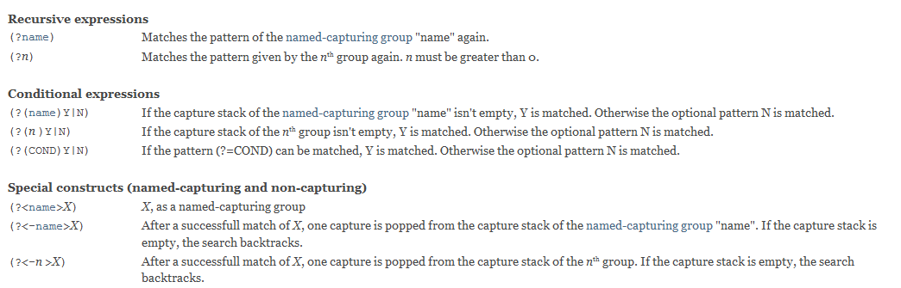
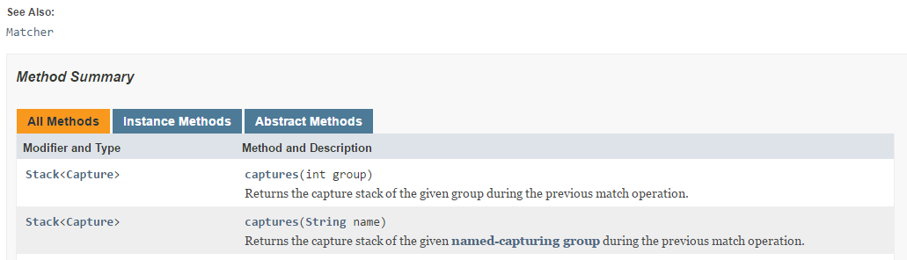

### Introduction
This is a Java Regular Expressions library. Compared to the Regular Expression library shipped with the Java JDK, it provides support for Recursive and Conditional Regular Expressions, adopts the concept of Captures from .Net and allows the user to install plugins into the regex engine.

In the following screenshot, all the new features are summarized.



### What's new :star:

### Version 1.0.3
- (?(DEFINE)never-executed-pattern)
- Plugins into the regex engine

### Version 1.0.2
- Recursive Regular Expressions
- Conditional Regular Expressions
- Captures

### Usage
The API is exactly the same as in java.util.regex. The only difference is that the required import statement is import com.florianingerl.util.regex.\*; instead of import java.util.regex.\*;

To illustrate the functionality, we will use the following utility functions
```
import com.florianingerl.util.regex.*;
...
private static void check(String p, String s, boolean expected) 
{
	Matcher matcher = Pattern.compile(p).matcher(s);
	if (matcher.find() != expected)
		failCount++;
}
static void check(String regex, String input, String[] expected) 
{
	List<String> result = new ArrayList<String>();
	Pattern p = Pattern.compile(regex);
	Matcher m = p.matcher(input);
	while (m.find()) {
		result.add(m.group());
	}
	if (!Arrays.asList(expected).equals(result))
		failCount++;
}
```
The following tests illustrate what you can do with Recursive Regular Expressions. Be aware that the syntax (?R) or (?0) as in Perl is not supported, only (?n) where n is greater than 0 or (?groupName) is supported.
```
String pattern = "1(jT(\\<((?1)(,|(?=\\>)))+\\>)?)2";
check(pattern, "1jT2", true);
check(pattern, "1jT<jT>2", true);
check(pattern, "1jT<jT,jT>2", true);
check(pattern, "1jT<jT<jT>>2", true);
check(pattern, "1jT<jT<jT>,jT<jT,jT>>2", true);

check("(\\(([^()]+|(?1))*+\\))", "(go away (here (everything) is fine) afterwards",
				new String[] { "(here (everything) is fine)" });
```
The following tests illustrate the concept of Captures. The basic idea is that for every group, a stack of captures is maintained. With \n where n is a valid group number or \k\<groupName\>, you always match the last capture of the respective group. With the syntax (?<-n>X) or (?<-groupName>X) you pop one capture from the capture stack of the respective group if X is matched. 

```
String pattern = "\\b(?<anagram>(?<letter>[a-zA-Z])(?anagram)?(?<-letter>\\k<letter>)|[a-zA-Z])\\b";
check(pattern, "anna is an anagram, so is lagerregal and otto and otito and every single letter like z",
			new String[] { "anna", "lagerregal", "otto", "otito", "z" });
```
The MatchResult interface also adds two methods providing access to the stack of captures for a group.



Finally, there is another way to match anagrams that only uses Conditional Regular Expressions. Note that the construct (?(1)(?!)) consisting of a condition and a negative look-ahead fails if and only if the capture stack of group 1 isn't empty!
```
String anagram = "\\b([a-zA-Z])*(?(1)[a-zA-Z]?|[a-zA-Z])(?<-1>\\1)*(?(1)(?!))\\b";
check(anagram, "anna is an anagram, so is lagerregal and otto and otito and every single letter like z",
		new String[] { "anna", "lagerregal", "otto", "otito", "z" });
```


### Maven Dependency
In order to use this library, add the following dependency to your pom.xml.
```
<dependency>
	<groupId>com.github.florianingerl.util</groupId>
	<artifactId>regex</artifactId>
	<version>1.0.2</version>
</dependency>
```

### Known Issues
Unfortunately this library needs more stacks than java.util.regex which can lead to a StackOverflowException more quickly in rare cases.
E.g. suppose you wanted to match Java strings with the regex 
```
"(\\.|[^"])*"
```
then this would only work for string lengths up to 3890, whereas with java.util.regex it would work with string lengths up to 6930. The problem is the
*-repetition that has to keep track of group captures and the backtracking options of the alternation. However a simple character class can be repeated nearly an unlimited number of times,
so the regex above could be improved to
```
"(?:\\.|[^"\\]+)*"
```
